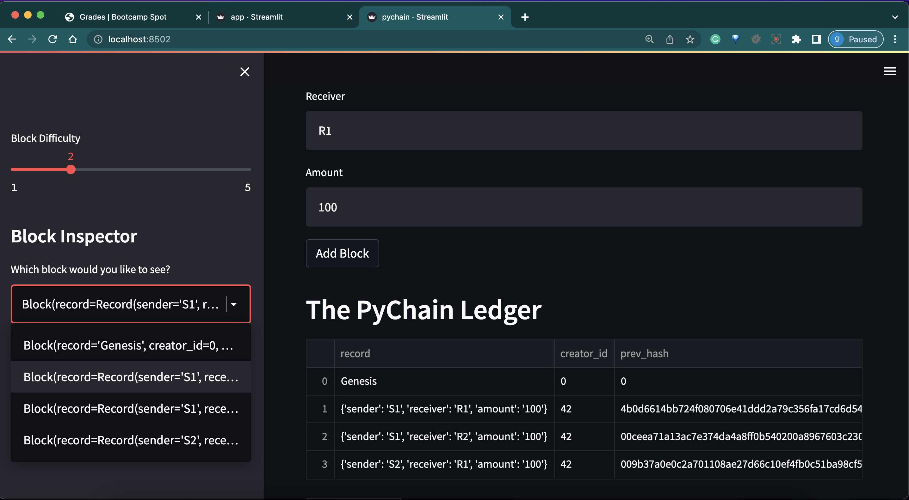
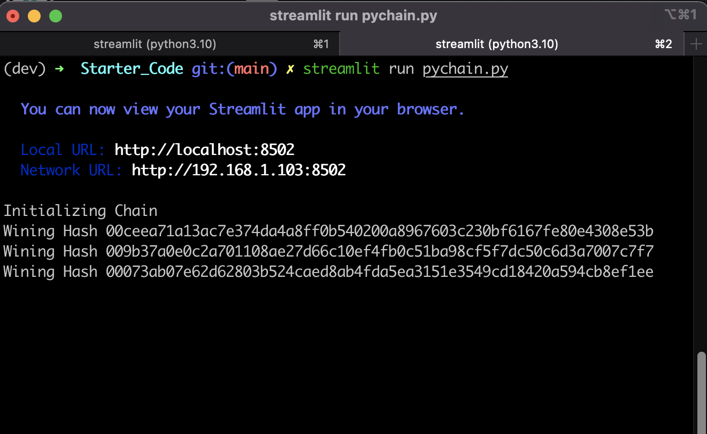
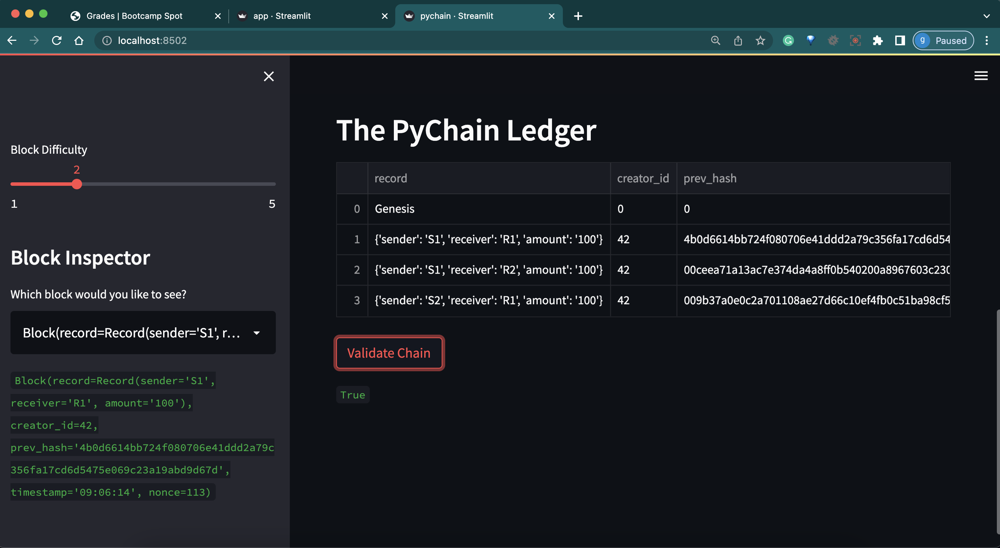

# PyChain Ledger

# Streamlit Installation Guide

This guide provides step-by-step instructions for installing Streamlit, a library that you will need for this unit. 

[Streamlit](https://docs.streamlit.io/en/stable/) is a Python library used to build a front-end interface for web applications.

To [install the Streamlit library](https://docs.streamlit.io/en/stable/installation.html) on your machine, complete the following steps.

1. Open a terminal instance, and activate your Conda development environment.

  ```shell
  conda activate dev
  ```
  `or`

1. Open a terminal instance, and create your Conda development environment.

  ```
    conda create --name py35 python=3.5
    ```

2. Run the following command in the terminal: 

  ```shell
  pip install streamlit
  ```

3. Confirm the installation by running the following command: 

  ```shell
  conda list streamlit
  ```

3. Activate 

  ```shell
  conda list streamlit
  ```


4. Run application

  ```shell
  streamlit run pychain.py
  ```
#### Running app


#### Terminal logs


#### Chain validation result


